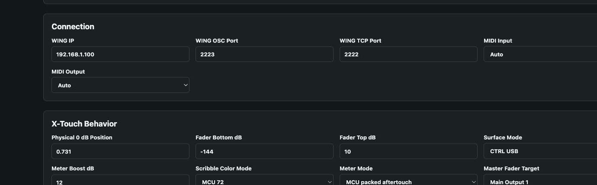
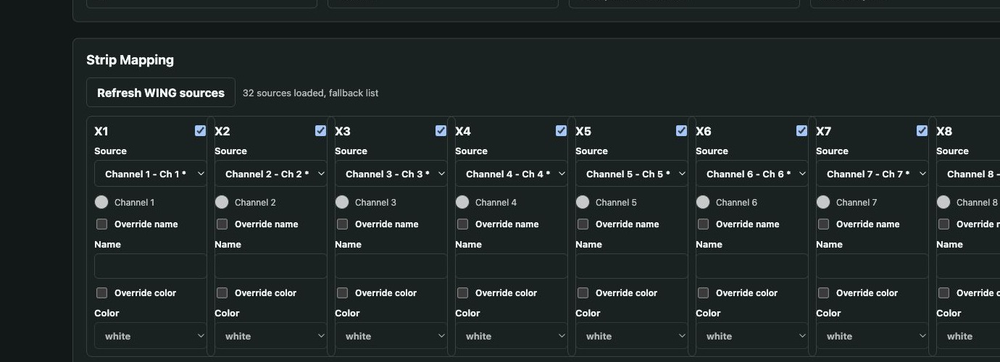
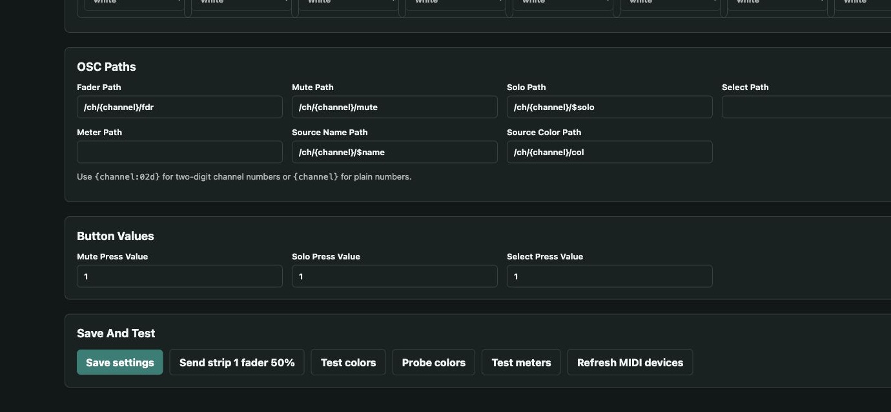

# WING X-Touch Bridge

Use a Behringer X-Touch to control a Behringer WING or WING Rack through a Raspberry Pi. Setup is done from a browser, and the bridge can run alongside Bitfocus Companion on the same Pi.

## What You Get

- Eight assignable X-Touch channel strips
- A configurable master fader for Main 1-4, Matrix 1-8, Aux 1-8, or DCA 1-16
- Two-way motor-fader and mute synchronization
- Live X-Touch channel meters
- WING channel names and colors on the scribble strips
- Optional name and color overrides for every strip
- Automatic recovery after restarting or power-cycling the X-Touch
- A setup page on port `8088`, separate from Companion

## Before You Start

You need:

- A Raspberry Pi running Raspberry Pi OS or the Bitfocus Companion Pi image
- The Pi's IP address, username, and password
- A Behringer X-Touch connected to the Pi with USB
- A WING or WING Rack on the same network
- The WING's IP address

## 1. Put The X-Touch In CTRL USB Mode

1. Turn off the X-Touch.
2. Hold the **Select** button on channel 1 while turning it on.
3. Choose **CTRL** as the mode and **USB** as the interface.
4. Confirm the selection on the X-Touch.

CTRL USB is recommended because it supports the tested scribble-strip color messages. MC USB can show filled meter bars, but the tested color commands do not work in that mode.

## 2. Install On The Raspberry Pi

Open Terminal on your computer and connect to the Pi. Replace `PI-IP-ADDRESS` with the Pi's address:

```bash
ssh pi@PI-IP-ADDRESS
```

If your Companion image uses a different username, replace `pi` with that username. Enter the Pi password when asked, then run:

```bash
git clone https://github.com/wtapper89/WingXTouchBridge.git
cd WingXTouchBridge
chmod +x install_on_pi.sh
sudo ./install_on_pi.sh
```

The first installation can take several minutes. The last line prints the browser address for the setup page.

## 3. Open The Setup Page

From a computer on the same network, open:

```text
http://PI-IP-ADDRESS:8088/
```

For example, a Pi at `192.168.1.50` uses `http://192.168.1.50:8088/`.

Enter the WING IP address. Leave the OSC port at `2223` and TCP port at `2222`. MIDI Input and MIDI Output can normally remain on **Auto**.

Under **X-Touch Behavior**:

1. Choose **CTRL USB** for Surface Mode.
2. Leave Physical 0 dB Position at `0.731` unless calibration is needed.
3. Choose the large fader's destination under **Master Fader Target**. It defaults to **Main Output 1**.



## 4. Assign The Eight Channel Strips

1. Press **Refresh WING sources**.
2. Use each Source dropdown to choose a WING channel.
3. Choose **None** when a strip should be unused.
4. Enable **Override name** or **Override color** only when the X-Touch should differ from the WING.

The bridge normally copies each selected channel's current WING name and color automatically.



## 5. Save And Test

Press **Save settings**. The bridge immediately reloads the surface and keeps the settings after Pi restarts.

The buttons at the bottom can test fader movement, colors, meters, and MIDI detection. Most users should leave the OSC paths and button values at their defaults.



## Master Fader Choices

The large ninth fader can control:

- Main Output 1-4
- Matrix 1-8
- Aux 1-8
- DCA 1-16
- None

Moving the assigned output in WING Edit or on the console moves the X-Touch master fader too.

## Meter Behavior

- **CTRL USB:** a single illuminated meter LED moves with the signal level. This is how the X-Touch firmware handles meter messages in CTRL mode.
- **MC USB:** filled meter bars are available, but the tested scribble-strip colors are not.

The physical X-Touch mode and the **Surface Mode** selected in the browser must match.

## Updating Later

Connect to the Pi again and run:

```bash
cd WingXTouchBridge
git pull
sudo ./install_on_pi.sh
```

The installer keeps the existing settings.

## Troubleshooting

**The X-Touch is blank after power-up**

Wait about five seconds. The bridge checks for the device and restores the surface automatically. If it remains blank, press **Refresh MIDI devices** and confirm the MIDI input and output.

**Colors do not change**

Confirm that both the physical X-Touch mode and the browser's Surface Mode are set to **CTRL USB**.

**Faders move to the wrong level**

Set **Physical 0 dB Position** to `0.731`. Adjust it slightly only if the X-Touch's printed 0 dB mark still differs from the WING.

**No WING sources appear**

Confirm the WING IP address and make sure TCP port `2222` and OSC port `2223` are reachable between the Pi and WING.

**Open the service log**

```bash
sudo journalctl -u wing-xtouch-bridge -f
```

Press `Ctrl+C` to exit the log.

## Service Commands

```bash
sudo systemctl status wing-xtouch-bridge
sudo systemctl restart wing-xtouch-bridge
```

Settings are stored at `/etc/wing-xtouch-bridge/config.json`.

## Network Safety

The setup page has no login. Use it only on a trusted control network, and do not expose port `8088` to the public internet.
